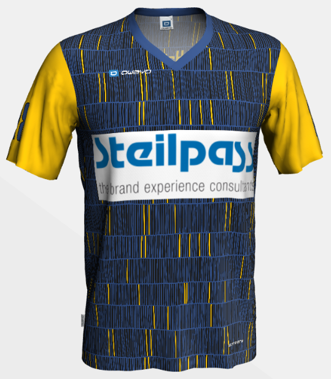
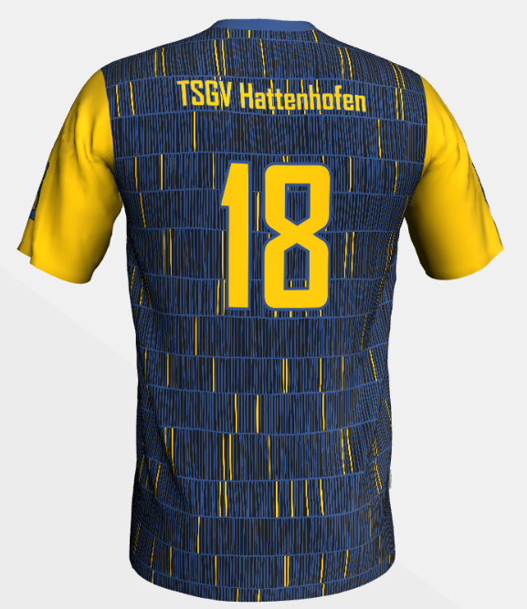
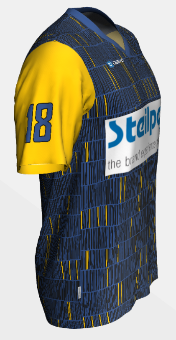

# Trikot 2022

Anforderungen:

- Kragenfarbe & Hosenfarbe wie Schriftfarbe des Steilpass Logo.
- rdemi Logo auf Ärmel oder Hose
- Logo TSGV Hattenhofen auf Hose
- Nummer auf Ärmel, optional, wenn kein Logo drauf ist...
- Torwarttrikot gleicher Stil, langärmlig, schwarze Farbe mit kräftiger (poppiger) Farbe z.B. Pink austauschen
- Ansonsten gilt halt, so dass es gut aussieht

Stückzahlen:

- 3 x Torwarttrikot (Nr. jeweils 01)
- 2 Sätze à 10 (Nr. 02-11)

## Logo Steilpass

## Logo rdemi

